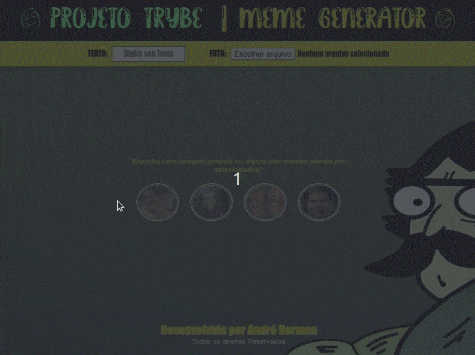

# PROJETO MEME GENERATOR 😎

- Neste projeto, o foco foi desenvolver minhas habilidades em js utilizando eventos diferentes nos elementos da página.

- O objetivo foi criar um gerador de memes personalizado, dando opção para o usuário utilizar alguns memes prontos ou importar novos localmente. Além disso, dando opção de estilização da borda e de texto na imagem.

- Como acréscimo para o projeto, adicionei botões para movimentação do texto de forma dinâmica e alterações de cor ao selecionar a borda.

---

  

   **[ABRIR PROJETO NO NAVEGADOR](https://andrehorman1994.github.io/PROJECT-05-MEME-GENERATOR/)**

---

# TECNOLOGIAS UTILIZADAS 💻

- **HTML**
- **CSS**
- **JAVASCRIPT**

---

# INSTRUÇÕES IMPORTANTES 📝

## COMO BAIXAR O PROJETO:

1. Clone o repositório:
   - **`git clone git@github.com:ANDREHORMAN1994/PROJECT-05-MEME-GENERATOR.git`**
2. Entre na pasta do repositório que você acabou de clonar: \* **`cd PROJECT-05-MEME-GENERATOR`**
     

## COMO RODAR O PROJETO:

1. Baixe a Extensão Live Server:
   _ Clique no ícone **`Extensions`** do Vs Code ou use o atalho **`CTRL + SHIFT + X`**
   _ Digite no campo de busca **`Live Server`**
   _ Instale a extensão
   _ Abra o arquivo **`index.html`** \* Clique no botão **`“Go Live”`** no canto inferior do Vs Code ou Execute o comando **`ALT + L ALT + O`** para abrir com o Live Server.
     

---

# VQV 🚀
